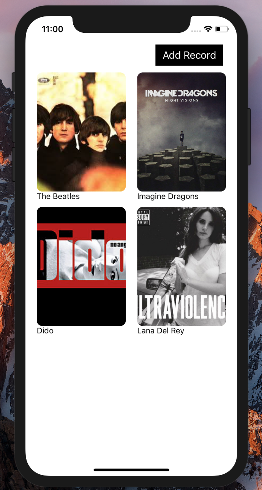
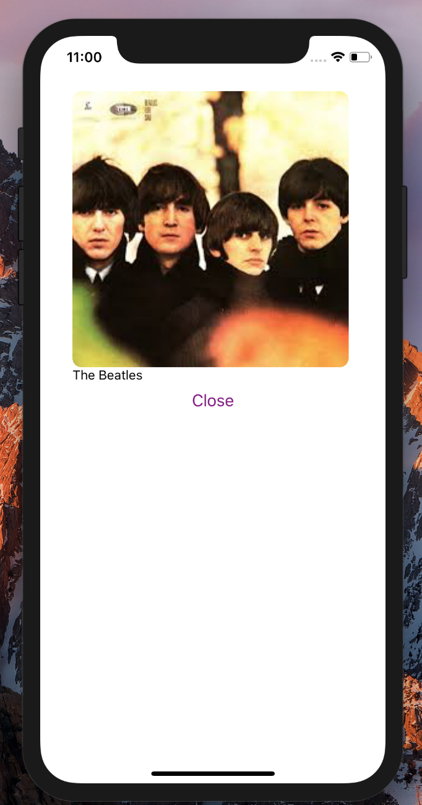
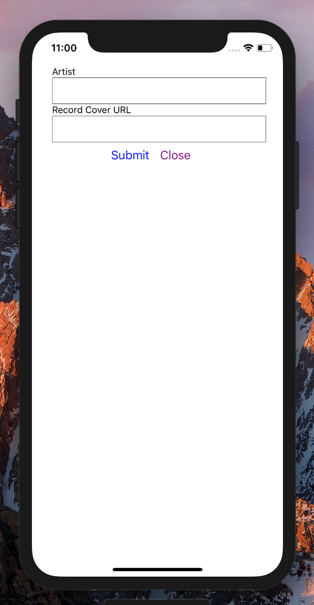

## Simple Demo App Using React Native & Node.js

Users can upload their record collection to keep track of what vinyl they have.





### Setup
After cloning, run ```npm install```.

Backend:
``` cd server```
``` sudo mkdir -p /data/db ```
``` sudo chmod 777 /data/db ```
``` mongod& ```
```nodemon server```

Frontend:
To see some fake data first:
```npm run populate```

To run the app locally:
```react-native run-ios```
